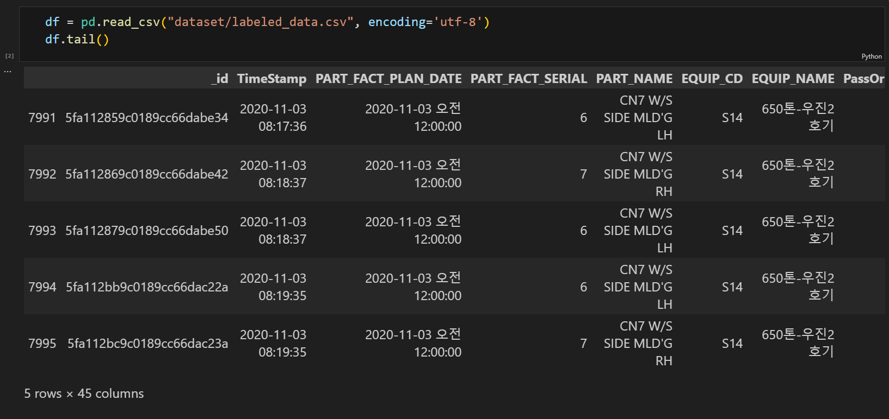

# 🏭 사출성형기 데이터를 이용한 사출 성형 최적 조건 분석

## 1️⃣ 팀 소개
#### SKN Family AI 캠프 11기  EDA 미니 프로젝트  
#### 기간: 2025.03.12 - 2025.03.14   

### 👤 팀원

<table>
  <thead>
    <td align="center">
      <a href="https://github.com/KimHyeongJu">
         

        김형주
      </a> 
    </td>
    <td align="center">
      <a href="https://github.com/REROUN">
         

        이 근
      </a> 
    </td>
    <td align="center">
      <a href="https://github.com/minjung2266">
         

        이민정
      </a> 
    </td>
  </thead>
</table>

  

## 2️⃣ 프로젝트 소개
### 사출성형이란?

- 플라스틱 성형법 중의 한 방법
- 열가소성 수지를 가열해서 유동 상태로 되었을 때 금형의 공동부에 가압 주입하여 금형 내에서 냉각시킴으로써, 금형의 공동부에 상당하는 성형품을 만드는 방법  
-> 사출성형기 데이터를 이용하여 사출 성형 최적 조건을 분석한다.  

### 📖 프로젝트 목표
  - 생산 효율 극대화 및 생산비용 절감
    - 사출성형품의 불량률을 최소화하여 생산 효율을 개선할 수 있다
- 공정 변수 최적화
    - 공정 변수를 최적화하여 불량률을 예측하여 사출 공정 과정 중에 생기는 품질 문제를 해결할 수 있다
 

### ⭐ 프로젝트 필요성
<table>
  <thead>
    <td><b>항목</b></td>
    <td><b>내용</b></td>
  </thead>
  <tbody>
    <tr>
      <td>현황</td>
      <td>사출성형은 다양한 산업에서 사용되는 제조 공정으로, 플라스틱 부품 생산에 많이 활용된다. 많은 기업들이 사출성형 공정을 개선하려고 노력하지만, 여전히 최적 조건을 분석하고 최적화하는 데에 한계가 있다.</td>
    </tr>
    <tr>
      <td>문제점</td>
      <td>사출성형 공정에서 비효율적인 공정은 원자재 낭비, 품질 불량 등을 초래한다.</td>
    </tr>
    <tr>
      <td>필요성</td>
      <td>사출성형기에서 발생하는 다양한 데이터(온도, 압력, 속도)를 분석하여, 각 공정의 최적 조건을 도출하고 공정의 변동성을 줄여야 한다.</td>
    </tr>
    <tr>
      <td>기대 효과</td>
      <td>1. 경쟁력 강화 : 최적화된 공정은 기업 경쟁력을 강화한다.   2. 생산성 향상 : 최적화된 공정 조건을 통해 생산 과정에서의 오류를 줄이고, 이는 전체적인 생산시간 단축으로 이어진다</td>
    </tr>
  </tbody>
</table>

  <a href="https://news.mt.co.kr/mtview.php?no=2025020715270842227">
    
     
    <strong>[2025년 2월 7일 MT 뉴스]</strong>
  </a>

  

## 3️⃣ 기술 스택
#### [데이터 시각화]

    
    
    
  

## 🔎분석 내용
1. 데이터의 속성별 의미
2. 사출 성형기 불량 요인 분석
3. 주요 원인의 영향이 되는 속성들

## 📚 분석 과정
### 1. 데이터 로드
* labeled_data : label이 있는 데이터
* unlabeled_data : label이 없는 데이터
1. 먼저 labeled_data를 불러와 전처리를 해준다.
2. labeled_data의 종속변수인 PassOrFail의 데이터가 비대칭이기에 unlabeled_data를 불러와 labeled_data와 합쳐준다.

### 2. 데이터 전처리
### 3. 데이터 시각화

## ⭐ 한 줄 회고
🧑🏻 형주

- EDA를 처음 해보는 프로젝트여서 많이 미숙했던 것 같지만 좋은 팀원들을 만나서 다행히 잘 끝낸 것 같습니다. 감사합니다.

🧑🏻‍🦱 근

- 

👱🏻‍♀️ 민정

- 공정 과정이 담긴 제조 데이터셋을 처음 다뤄봤는데, 생각보다 피쳐에 대한 이해가 힘들어 조금 아쉬웠습니다. 하지만 정제되지 않은 데이터를 다뤄봤다는 점에서 의미 있는 프로젝트였습니다.
