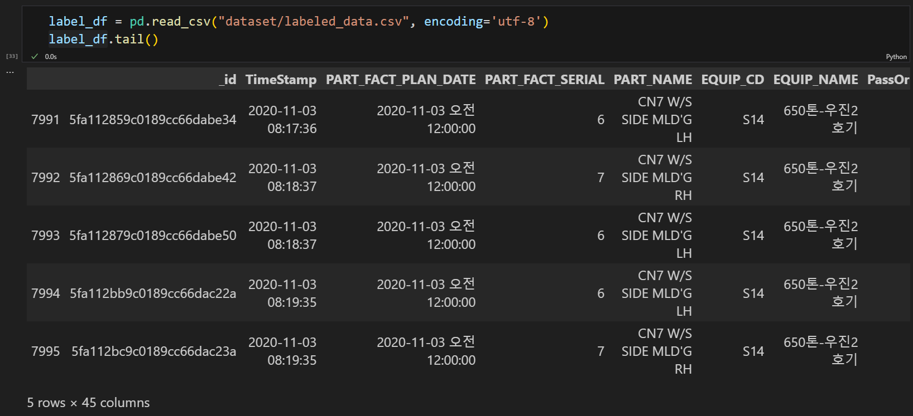

# 🏭 사출성형기 데이터를 이용한 사출 성형 최적 조건 분석

## 1️⃣ 팀 소개
#### SKN Family AI 캠프 11기  EDA 미니 프로젝트  
#### 기간: 2025.03.12 - 2025.03.14   

### 👤 팀원

<table>
  <thead>
    <td align="center">
      <a href="https://github.com/KimHyeongJu">
         

        김형주
      </a> 
    </td>
    <td align="center">
      <a href="https://github.com/REROUN">
         

        이 근
      </a> 
    </td>
    <td align="center">
      <a href="https://github.com/minjung2266">
         

        이민정
      </a> 
    </td>
  </thead>
</table>

  

## 2️⃣ 프로젝트 소개
### 사출성형이란?

- 플라스틱 성형법 중의 한 방법
- 열가소성 수지를 가열해서 유동 상태로 되었을 때 금형의 공동부에 가압 주입하여 금형 내에서 냉각시킴으로써, 금형의 공동부에 상당하는 성형품을 만드는 방법  
-> 사출성형기 데이터를 이용하여 사출 성형 최적 조건을 분석한다.  

### 📖 프로젝트 목표
  - 생산 효율 극대화 및 생산비용 절감
    - 사출성형품의 불량률을 최소화하여 생산 효율을 개선할 수 있다
- 공정 변수 최적화
    - 공정 변수를 최적화하여 불량률을 예측하여 사출 공정 과정 중에 생기는 품질 문제를 해결할 수 있다
 

### ⭐ 프로젝트 필요성
<table>
  <thead>
    <td><b>항목</b></td>
    <td><b>내용</b></td>
  </thead>
  <tbody>
    <tr>
      <td>현황</td>
      <td>사출성형은 다양한 산업에서 사용되는 제조 공정으로, 플라스틱 부품 생산에 많이 활용된다. 많은 기업들이 사출성형 공정을 개선하려고 노력하지만, 여전히 최적 조건을 분석하고 최적화하는 데에 한계가 있다.</td>
    </tr>
    <tr>
      <td>문제점</td>
      <td>사출성형 공정에서 비효율적인 공정은 원자재 낭비, 품질 불량 등을 초래한다.</td>
    </tr>
    <tr>
      <td>필요성</td>
      <td>사출성형기에서 발생하는 다양한 데이터(온도, 압력, 속도)를 분석하여, 각 공정의 최적 조건을 도출하고 공정의 변동성을 줄여야 한다.</td>
    </tr>
    <tr>
      <td>기대 효과</td>
      <td>1. 경쟁력 강화 : 최적화된 공정은 기업 경쟁력을 강화한다.   2. 생산성 향상 : 최적화된 공정 조건을 통해 생산 과정에서의 오류를 줄이고, 이는 전체적인 생산시간 단축으로 이어진다</td>
    </tr>
  </tbody>
</table>

  <a href="https://news.mt.co.kr/mtview.php?no=2025020715270842227">
    
     
    <strong>[2025년 2월 7일 MT 뉴스]</strong>
  </a>

  

## 3️⃣ 기술 스택
#### [데이터 시각화]

    
    
    
  

## 🔧WBS

| 작업명         | 시작일   | 완료일   | 담당자 | 산출물 |
|----------------|----------|----------|--------|--------|
| 프로젝트 주제 선정 | 25.03.10 | 25.03.12 |  ALL  | -  |
| 데이터 전처리 | 25.03.12 | 25.03.14 |   ALL   | -      |
| 시각화 | 25.03.13 | 25.03.14 |  ALL      | -      |

## 🔎분석 내용
1. 데이터의 속성별 의미 

|Attributes Name|Description|Unit|
|------|---|---|
|_id|제조 공정 id|-|
|TimeStamp|시간|-|
|PART_FACT_PLAN_DATE|생산을 지시한 날짜|-|
|PART_FACT_SERIAL|생산을 지시한 품목에 대한 코드 부여|-|
|PART_NAME|제품의 이름|-|
|EQUIP_CD|생산한 사출기 호기|-|
|EQUIP_NAME|생산한 사출기 모델명|-|
|PassOrFail|사출되는 각 물품 마다 검수자가 양품 선별을 하여 붙이는 레이블 값|0:불, 1:양|
|Reason|검수자가 양품선별 시, 불량으로 확인된 제품에 대해 불량 유형을 나타냄|-|
|Injection_Time|고압+사출시간(고압(사출압) : 재료를 금형에 유입시킬때의 압력), 사출 시간 : 재료를 금형에 유입시키는데 소요되는 시간|sec(초)|
|Filling_Time|충진시간으로 사출기에서 금형으로 내용물이 주입되는 시간|sec(초)|
|Plasticizing_Time|계량시간으로 재료를 스크류에 1번 생산할 만큼 용융되어 저장되는 시간|sec(초)|
|Cycle_Time|1번의 제품생산에 소요되는 생산시간|sec(초)|
|Clamp_Close_Time|제품이 생산되고 난후 열려있는 금형을 사출기가 닫아주고 빈틈이 없이 고정축과 이동축을 꽉 잡아주는데 걸리는 시간|sec(초)|
|Cushion_Position|보압(사출압의 다음으로 가해지는 압력(금형내부압력을 조절하여 과충전을 방지))을 하기위한 스크류의 위치|mm|
|Switch_Over_Position|고압,보압절환위치(고압(사출압)에서 보압으로 진행될때의 위치)|mm|
|Plasticizing_Position|계량완료위치(계량을 마친 스크류의 위치)|mm|
|Clamp_Open_Position|제품이 생산되어 추출하기위해 금형이 열리고 난 위치|mm|
|Max_Injection_Speed|배럴에 계량되어 있는 용융수지가 금형으로 흘러들어가는데 측정되는 최대속도|mm/s|
|Max_Screw_RPM|사출을 위한 스크류의 최대속도|mm/s|
|Average_Screw_RPM|사출을 위한 스크류의 평균속도|mm/s|
|Max_Injection_Pressure|배럴에 계량되어 있는 용융수지가 금형으로 흘러들어가는데 가해지는 최대압력|MPa|
|Max_Switch_Over_Pressure|사출에서 보압(충진된 수지가 밀리지않게 압력을준다)으로 변환되는 압력|MPa|
|Max_Back_Pressure|수지가 계량이 되는중에 스크류가 밀려나는 현상을 저지하기위한 최대압력|MPa|
|Average_Back_Pressure|수지가 계량이 되는중에 스크류가 밀려나는 현상을 저지하기위한 평균압력|MPa|
|Barrel_Temperature_1 ~ 7|계량 및 사출시 수지가 일정하게 용융(녹임)을 유지하기위해 온도가 일정해야한다|MPa|
|Hopper_Temperature|재료주입구의 온도(충분히 건조시켜주며 재료가 용융되는시간을 절약시켜주기위해 온도가 높아야한다)|섭씨 (ºC)|
|Mold_Temperature_1 ~ 12|재료주입구의 온도(충분히 건조시켜주며 재료가 용융되는시간을 절약시켜주기위해 온도가 높아야한다)|섭씨 (ºC)|

2. 사출 성형기 불량 요인 분석

  
쇼트숏(충전연료 부족)

* 원료 공급불량
* 충전압력 부족
* 금형 내 유동 중의 원료 고화
* 금형 내의 공기 저항

* 성형품 주입부 이외의 부분으로 용융 플라스틱 유출되어 고화
* 압축되어진 용융 플라스틱의 온도 저하에 의한 체적의 감소, 압력 저하에 동반하는 체적의 증가 균형이 깨지는 것이 직접원인
* 용융원료가 금형 내를 주름 상으로 파동하며 흘러서 금형면과 보다 많이 접촉한 부분이 앞서 고화되는 문제
* 성형품이 고화되기 전에 표면을 가스가 지나간 흔적으로 인해 은조흔 발생생
* 금형면에 플라스틱이 충분히 압착되지 못하기도 하고 노즐로부터 배출된 가스가 금형표면에 응축해서 플라스틱 층과 금형면의 직접 접착을 방해하는 것이 원인
* 성형품에 빈틈부가 있는 경우 두께의 변화가 있어 두꺼운 부분으로부터 엷은 부분으로 일방적으로 원료를 흐르게 하지 않는 경우 게이트가 2개 이상있는 경우에는 웰드라인의 발생은 피할 수 없다.
* 다량의 가스가 노즐로부터 방출되어지기도 하고 금형 내에서 용융 플라스틱에 충분한 압력이 작용하지 않는 경우에 발생한다.
* 성형수축률이 크고, 그 수치가 불균일한 두께에 따른 냉각속도의 차이 등으로 인해 부분적으로 상당히 변화하는 폴리에틸렌, 폴리프로필렌 등에서는 특히 문제가 되는 일이 많다.
3. 주요 원인의 영향이 되는 속성들
* 양 관련 : Clamp_Open_Position, Plasticizing_Position, Switch_Over_Position, Cushion_Position
* 압력 관련 : Max_Injection_Pressure, Max_Switch_Over_Pressure, Average_Back_Pressure
* 온도 관련 : Barrel_Temperature_1 ~ 7, Hopper_Temperature, Mold_Temperature_1 ~ 12
* 속도 관련 : Average_Screw_RPM, Max_Screw_RPM, Max_Injection_Speed
* 시간 관련 : Injection_Time, Filling_Time, Plasticizing_Time, Cycle_Time, Clamp_Close_Time

## 📚 분석 과정
### 1. 데이터 로드
* labeled_data : label이 있는 데이터
* unlabeled_data : label이 없는 데이터
##### 1. 먼저 labeled_data를 불러와 전처리를 해준다.

##### 2. labeled_data의 종속변수인 PassOrFail의 데이터가 비대칭이기에 unlabeled_data를 불러와 labeled_data와 합쳐준다.

### 2. 데이터 전처리
### 3. 데이터 시각화

## ⭐ 한 줄 회고
🧑🏻 형주

- EDA를 처음 해보는 프로젝트여서 많이 미숙했던 것 같지만 좋은 팀원들을 만나서 다행히 잘 끝낸 것 같습니다. 감사합니다.

🧑🏻‍🦱 근

- 과거 공정 데이터셋 EDA를 해보았으니 아무것도 모르고 시도했을 때와 다르게 이번에는 더 자세히 분석해 볼 수 있어 매우 도움이 되었습니다. 

👱🏻‍♀️ 민정

- 🥹 공정 과정이 담긴 제조 데이터셋을 처음 다뤄봤는데 생각보다 피쳐에 대한 이해가 힘들어 조금 아쉬웠습니다
  
- ☺️ 정제되지 않은 데이터를 다뤄봤다는 점에서 의미 있었고, 분석을 어떻게 진행하고 데이터를 나눌지, 분석 결과를 어떻게 시각화해야 좋을지 생각하며 많은 공부가 되었습니다
  
